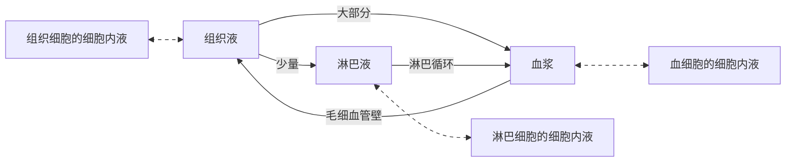

# 第一章 细胞学基础

## 细胞学说

- 关键人物
  - 罗伯特·胡克 观察到木栓细胞（死细胞）
  - 列文虎克观察到大量微小的活细胞
  - 施莱登提出"细胞是 **植物体** 的基本单位"
  - 施旺提出"动物体也是由细胞构成的"
  - 耐格里发现新细胞的产生原来是 **细胞分裂** 的结果
  - 魏尔肖 总结出"细胞通过分裂产生新细胞"
- 内容
  - 细胞是一个有机体，一切 **动植物** 都由细胞发育而来，并由细胞和细胞产物所构成
  - 细胞是一个 **相对独立** 的单位，既有它自己的生命，又对与其他细胞共同组成的整体生命起作用
  - 新细胞是由老细胞分裂产生的
- 方法：不完全归纳法

## 走近细胞

- 细胞是基本的生命系统
- 生物类型
  - 单细胞生物能够 **独立** 完成生命活动
  - 多细胞生物依赖 **各种分化的细胞** 密切合作，共同完成一系列复杂的生命活动
  - 病毒无细胞结构，需依赖 **活细胞** 才能生活
- 生命现象
  - 以 **细胞代谢** 为基础的各种生理活动
  - 以细胞 **增殖、分化** 为基础的生长发育
  - 以细胞内 **基因的传递和变化** 为基础的遗传与变异
- 层次：细胞→组织→器官→系统→个体→种群→群落→生态系统→生物圈

## 细胞

- 多样性
  - 真核生物：动物、植物、 真菌
  - 原核生物
    - 本质：无 **以核膜为界限** 的细胞核
    - 实例
      - 蓝细菌：含 **藻蓝素** 和叶绿素，能进行光合作用
      - 细菌：大肠杆菌、乳酸菌、醋酸菌等
      - 支原体、衣原体等
    - 生活方式：大多营 **腐生或寄生** 生活，少数为自养型
- 统一性： 都有相似的 **细胞膜、细胞质、核糖体**，都以 DNA 作为遗传物质

## 显微镜

- 原理
  - 成像特点：倒转 180° 的虚像
  - 移动规律：目标物像在哪，朝哪移（偏哪往哪移）
  - 放大倍数：目镜放大倍数 × 物镜放大倍数
- 步骤：低倍镜下看清物像→将目标 **移至视野中央** →转动转换器，换高倍镜→调节视野亮度→调节 **细准焦螺旋**，使物像清晰

# 第二章 元素和化合物

## 元素

- 存在形式：主要以**化合物**的形式存在
- 分类
  - 大量元素：C、H、O、N、P、S、K、Ca、Mg等
  - 微量元素（含量低于万分之一）：Fe、Mn、B、Zn、Mo、Cu等

## 化合物

- 无机物
  - 水
    - 结合水：**细胞结构**的重要组成成分
    - 自由水：①提供细胞生活的液体环境  ②细胞内的**良好溶剂 ** ③参与细胞内的生物化学反应  ④运输营养物质和代谢废物
  - 无机盐
    - 存在形式：主要以**离子**的形式存在
    - 功能：①某些化合物的成分  ②维持细胞和生物体的生命活动  ③维持细胞的渗透压和**酸碱平衡**
- 有机物
  - 糖类
    - 元素组成：通常含有 C、H、O，几丁质还含有N
    - 种类
      - 单糖：如葡萄糖、果糖、半乳糖、核糖、脱氧核糖
      - 二糖
        - 植物特有：蔗糖、麦芽糖
        - 动物特有：乳糖
      - 多糖
        - 植物特有：纤维素（构成植物**细胞壁**）、淀粉（储能）
        - 动物特有：糖原（储能）、几丁质
    - 功能：生命活动的**重要能源物质**
  - 脂质
    - 元素组成：C、H、O（N、P）
    - 特点：脂质分子中**氧**的含量远低于糖类，而氢的含量更高
    - 种类
      - 脂肪
        - 组成：1 分子甘油 + 3 分子**脂肪酸**
        - 功能：储能物质；缓冲、减压；保温
      - 磷脂：构成细胞膜和多种细胞器膜
      - 固醇：包括胆固醇、性激素、**维生素D**
  - 核酸
    - 元素组成：C、H、O、N、P
    - 种类：脱氧核糖核酸（DNA）、核糖核酸（RNA）
    - 基本单位：核苷酸（1 分子**五碳糖** + 1 分子含氮碱基 + 1 分子磷酸）
    - 功能：携带遗传信息，参与生物体的遗传、变异和蛋白质的生物合成
    - 多样性：核苷酸的**数量和排列顺序**不同
  - 蛋白质
    - 元素组成：C、H、O、N（S）等
    - 基本单位：氨基酸（包括 13 种非必需氨基酸和8种必需氨基酸）
    - 形成：氨基酸→肽链→蛋白质
    - 功能：生命活动的主要承担者
    - 多样性：氨基酸的**种类、数量、排列顺序**和蛋白质的空间结构不同

# 第三章 细胞的基本结构

## 细胞

- 细胞壁

  - 主要成分
    - 植物：纤维素 和果胶
    - 细菌：肽聚糖
    - 真菌：几丁质
  - 主要功能：支持和保护

- 细胞膜

  - 主要功能：①将细胞与外界环境分隔开  ②控制物质进出细胞  ③进行细胞间的**信息交流**
  - 主要成分
    - 脂质：主要含有磷脂
    - 蛋白质：种类和数量越多，细胞膜**功能越复杂**
    - 少量糖类：分布在膜**外侧**，与脂质或蛋白质结合
  - 流动镶嵌模型
    - 基本支架：**磷脂双分子层**
    - 结构特点：具有**一定的流动性**
    - 功能特点：具有**选择透过性**

- 细胞质

  - 细胞质基质

    - 组成成分：水、无机盐、蛋白质、核苷酸等
    - 功能：细胞代谢的主要场所

  - 细胞器

    - 分离方法：**差速离心法**

    - | 膜的层数                               | 分布                   |
      | -------------------------------------- | ---------------------- |
      | 单层膜：内质网、高尔基体、液泡、溶酶体 | 植物特有：叶绿体、液泡 |
      | 双层膜：线粒体、叶绿体                 | 动物（主要）：溶酶体   |
      | 无膜：[核糖体](#翻译)(#翻译)、中心体   | 动物（主要）：溶酶体   |

    - 分泌蛋白的合成和运输

      - 研究方法：**同位素标记法**
      - 过程：核糖体→内质网→高尔基体→细胞膜

- 细胞核

  - 结构
    - 核膜：双层膜，把核内物质与细胞质分开
    - 核仁：与**某种RNA的合成以及核糖体的形成** 有关
    - 染色质
      - 主要由DNA和蛋白质组成
      - 易被**碱性染料** 染成深色
      - 与染色体的关系：**同一物质在细胞不同时期的两种存在状态**
    - 核孔：实现核质之间频繁的物质交换和**信息交流**
  - 功能
    - 遗传信息库、细胞**代谢和遗传**的控制中心

# 第四章 物质进出细胞的方式

## 渗透作用

- 定义：指水分子或其他溶剂分子通过半透膜从**低浓度**溶液到**高浓度**溶液的扩散过程
- 条件：具有一层**半透膜**
- 膜两侧有浓度差

## 细胞的吸水和失水

- 动物细胞
  - 细胞膜相当于一层半透膜
  - 吸水或失水取决于**细胞质**与外界溶液的浓度大小
- 成熟植物细胞
  - 方式：**渗透作用**
  - 质壁分离及复原
    - 原理
      - 原生质层相当于一层半透膜
      - 原生质层比细胞壁的**伸缩性大**
      - 细胞液与外界溶液存在浓度差
    - 实验
      - 选材：紫色洋葱鳞片叶外表皮
      - 对照：自身前后对照
      - 观察：低倍显微镜下观察三次

## 运输方式

- 被动运输
  - 定义：物质以**扩散**方式进出细胞，不需要消耗细胞内**化学反应**所释放的能量
  - 分类
    - 自由扩散
      - 定义：通过简单的扩散作用进出细胞的方式
      - 实例：水、气体分子、**脂溶性**小分子（甘油、乙醇、苯等）
    - 协助扩散
      - 定义：借助膜上的**转运蛋白**进出细胞的物质扩散方式
      - 举例：离子和一些小分子有机物如葡萄糖、氨基酸的**顺**浓度梯度运输、水经过通道蛋白的运输
      - 影响因素：浓度差、**转运蛋白**的数量
- 主动运输
  - 定义：物质**逆**浓度梯度进行跨膜运输，需要**载体蛋白**的协助，同时还需要消耗细胞内化学反应所释放的能量
  - 举例：离子、葡萄糖、氨基酸等的逆浓度梯度运输
  - 意义：通过主动运输来选择吸收**所需要的物质**，排出**代谢废物**和对细胞有害的物质，从而保证细胞和个体生命活动的需要
- 胞吞和胞吐
  - 举例：蛋白质等**大分子**的运输（某些小分子如神经递质也可以）
  - 胞吞：细胞摄取的大分子与膜上的蛋白质结合，引起这部分细胞膜内陷形成小囊，包围着大分子。小囊从细胞膜上分离下来形成囊泡，进入细胞内部
  - 胞吐：细胞外排的大分子在细胞内形成囊泡，囊泡移动到细胞膜处，与细胞膜融合，将大分子排出细胞
  - 特点：需要**消耗能量**

# 第五章 酶与ATP

## 酶

- 定义：**活细胞**产生的具有催化作用的**有机物**
- 本质：大部分为**蛋白质**，少数为RNA
- 作用机理：能显著地降低化学反应的**活化能**
- 特性
  - 专一性
    - 表现：一种酶只能催化**一种或一类**化学反应
    - 意义：使细胞代谢有条不紊地进行
  - 高效性
    - 表现：酶的催化效率远高于**无机催化剂**
    - 原理：相比无机催化剂，酶能**更显著**地降低化学反应的活化能
  - 作用条件较温和
    - 在**最适温度和最适pH**时，酶的活性最强
    - 过酸、过碱和高温会使酶的**空间结构**遭到破坏，使酶永久失活
    - 低温条件下，酶活性较低，但空间结构稳定
- 影响酶促反应速率的因素
  - 酶活性：受pH、温度、激活剂和抑制剂等影响
  - 底物浓度和酶浓度
- 相关实验
  - 高效性：一组加酶，另一组加**无机催化剂**
  - 专一性：检测同一种酶对不同底物的催化情况
  - 探究温度对酶活性的影响：一般不选择过氧化氢酶
  - 探究pH对酶活性的影响：一般不选择淀粉酶

## ATP

- 中文名：**腺苷三磷酸**
- 元素组成：C、H、O、N、P
- 结构简式：A-P-P-P   （A：腺苷、 P：磷酸基团、 ～：**特殊的化学键**）
- 功能：直接能源物质
- ATP和ADP的转化
  - ATP的合成
    - 过程：**光合作用、呼吸作用**等
    - 能量来源：光能、有机物中稳定的化学能
    - 特点：与**放能反应**相联系
  - ATP的水解
    - 过程：肌肉收缩、大脑思考、主动运输等
    - 特点：与吸能反应相联系
- 特点：含量极少，ATP与ADP的相互转化非常迅速及时，且处于**动态平衡**之中

# 第六章 细胞呼吸

-  类型

   - 有氧呼吸
   - 阶段
     - 第一阶段（细胞质基质）：C₆H₁₂O₆ → 2C₃H₄O₃ + 4[H] + 少量能量
     - 第二阶段（线粒体基质）：2C₃H₄O₃ + 6H₂O → 6CO₂ + 20[H] + 少量能量
     - 第三阶段（线粒体内膜）：24[H] + 6O₂ → 12H₂O + **大量能量**
   - 总反应式：C₆H₁₂O₆ + 6H₂O + 6O₂ → 6CO₂ + 12H₂O + 大量能量
   - 无氧呼吸
     - 场所：**细胞质基质**
     - 总反应式
       - C₆H₁₂O₆ → 2C₂H₅OH + 2CO₂ + 少量能量
       - C₆H₁₂O₆ → 2C₃H₆O₃ + 少量能量

-  意义：提供能量、**生物体代谢的枢纽**

-  影响因素：氧气浓度:CO₂总释放量、温度、CO₂浓度：随CO₂浓度增加，呼吸受到**抑制**、水(在一定范围内，随水分含量增加，呼吸强度增加)

-  应用

   - 中耕松土、适时排水，促进作物根系的**呼吸作用**，利于作物的生长

   - 储藏果实、蔬菜可降低**温度**和**氧气**含量，减弱呼吸作用，以减少有机物的消耗

   - 包扎伤口时，需要选用透气的消毒纱布或"创可贴"，防止**厌氧菌**的繁殖

   - 提倡慢跑等有氧运动能避免肌细胞进行**无氧呼吸**产生大量乳酸，乳酸的大量积累会使肌肉酸胀乏力

# 第七章 光合作用

## 光合色素的提取和分离

- 原理
  - 提取：绿叶中的色素溶于**有机溶剂**
  - 分离：各种色素因在层析液中的**溶解度**不同而扩散速率不同
- 试剂： CaCO₃：**防止色素被破坏**、SiO₂：有助于**研磨充分**

## 过程

- 光反应
  - 场所：**类囊体薄膜**
  - 过程
    - 水的光解：2H₂O → 4H⁺+O₂+4e⁻
    - NADPH的合成：NADP⁺+H⁺+2e⁻ → NADPH
    - ATP的合成：ADP+Pi+能量 → ATP
- 暗反应
  - 场所：**叶绿体基质**
  - 总反应式
    - CO₂的固定：C₅+CO₂ → 2C₃
    - C₃的还原：2C₃ → (CH₂O)+C₅（ATP、NADPH、酶）

## 能量转换

- 光能→**ATP和NADPH中活跃的化学能**→有机物中的化学能

## 影响因素

- 光照强度
- CO₂浓度
- 温度（ 原理：温度通过影响**酶的活性**影响光合速率）
- 水： 水是光合作用的原料；失水会引起**气孔关闭**，从而减少叶片对CO₂的吸收
- 矿质元素： N、Mg参与**叶绿素**的合成；N、P与磷脂、ATP等合成有关

# 第八章 细胞分裂

## 有丝分裂

- 细胞周期

  - 定义：**连续分裂**的细胞，从一次分裂完成时开始，到下一次分裂完成时为止

  - 时期
    - 分裂间期：进行**DNA的复制**和蛋白质的合成，细胞有适度的生长
    - 分裂期
      - 前期："膜仁消失显两体"（核膜消失，核仁解体，**纺锤体、染色体**出现）
      - 中期："形数清晰赤道齐"（纺锤丝牵引染色体移动到赤道板上）
      - 后期："粒裂数增均两极"（着丝粒分裂，**染色体**数目倍增，子染色体被纺锤丝牵引移向两极）
      - 末期："两消两现重开始"（染色体螺旋为染色质，纺锤体消失，核膜、核仁重现）

- 动植物区别

  - 前期
    - 动物：中心粒周围发出大量**星射线**，形成纺锤体
    - 植物：从细胞两极发出**纺锤丝**，形成纺锤体

  - 末期
    - 动物：细胞膜从细胞中部向内凹陷，缢裂成两个子细胞
    - 植物：**细胞板**逐渐拓展，形成新的细胞壁

- 意义：在**细胞**的亲代和子代之间保持了遗传的稳定性

## 无丝分裂

- 特点：分裂过程中不出现**纺锤丝和染色体**的变化

- 过程：细胞核延长→核的中部向内凹陷，缢裂→整个细胞从中部缢裂

- 实例：蛙的红细胞

## 减数分裂

- 范围：进行**有性生殖**的生物

- 特点

  - **染色体**复制一次，细胞连续分裂两次

  - 成熟生殖细胞中的染色体数目比原始生殖细胞少一半

- 过程

  - 减数分裂Ⅰ
    - 前期：同源染色体联会，同源染色体上**非姐妹染色单体**互换
    - 中期：同源染色体成对排列在赤道板两侧
    - 后期：同源染色体分离，**非同源染色体**自由组合
    - 末期结束：一个细胞分裂成两个细胞

  - 减数分裂Ⅱ
    - 前期：染色体散乱分布，无**同源染色体**
    - 中期：染色体排列在赤道板上
    - 后期：着丝粒分裂，姐妹染色单体分离
    - 末期结束：减数分裂Ⅰ形成的两个细胞再分裂成四个子细胞

- 两次分裂：减数分裂Ⅰ同源染色体分离，染色体数目减半，减数分裂Ⅱ**姐妹染色单体**分离

- 精卵差异

  - 细胞质分裂：精母细胞和**第一极体**均等分裂；卵母细胞不均等分裂

  - 结果：1个精原细胞→4个精子；一个卵母细胞→1个卵细胞+3个极体

- 配子多样性

  - 减数分裂Ⅰ前期（四分体时期）：同源染色体上非姐妹染色单体互换

  - 减数分裂Ⅰ后期：**非同源染色体**自由组合

# 第九章 细胞的分化、衰老和死亡

## 细胞的分化

- 本质：基因的**选择性表达**
- 结果：细胞的**形态、结构和生理功能**上发生稳定性差异
- 特点：普遍性、持久性、稳定性、不可逆性
- 意义：**个体发育**的基础；细胞趋向**专门化**，有利于提高生物体各种生理功能的效率
- 全能性：定义：细胞经分裂和分化后，仍具有产生**完整有机体**或分化成其他各种细胞的潜能和特性；原因：已分化的细胞仍具有本物种个体发育所需的**全套遗传物质**

## 细胞的衰老

- 特征：细胞内的水分**减少**，细胞萎缩，体积变小；细胞膜通透性改变，物质运输功能**降低**；多种酶的活性降低，呼吸速率减慢，新陈代谢速率减慢；细胞内的色素逐渐积累，妨碍细胞内**物质的交流和传递**；细胞核的体积**增大**，核膜内折，染色质收缩、染色加深
- 原因
  - 自由基学说：自由基：异常活泼的**带电分子或基团**；原理：自由基攻击和破坏细胞内各种执行正常功能的生物分子
  - 端粒学说：端粒：染色体两端具有特殊序列的**DNA—蛋白质复合体**；端粒DNA序列在每次细胞分裂后会**缩短一截**；原理：端粒内侧的正常基因的DNA序列受损

## 细胞死亡

- 细胞凋亡：实质：由**基因**决定的细胞自动结束生命的过程；类型：个体发育中细胞的程序性死亡；成熟生物体中细胞的**自然更新**；被病原体感染的细胞的清除；完成正常发育；意义：维持**内部环境**的稳定；抵御外界各种因素的干扰
- 细胞坏死：不利因素影响下，**由细胞正常代谢活动受损或中断**引起的细胞损伤和死亡

## 细胞自噬

- 实质：在一定条件下，细胞会将受损或功能退化的细胞结构等，通过**溶酶体**降解后再利用
- 类型：营养缺乏条件→获得维持生存所需的**物质和能量**；细胞受到损伤、微生物入侵或细胞衰老→维持细胞内部环境的稳定；有些激烈的细胞自噬，可能诱导**细胞凋亡**

# 第十章 基因分离定律

## 实验材料—豌豆

- 优点
  - **自花**传粉，**闭花**受粉，自然状态下一般为纯种
  - 具有多对易于区分的相对性状
  - 花较大，易于操作
  - **子代数目多**，便于统计分析
  - 生长周期短，易栽培
- 杂交操作
  - 对**母本**去雄（花未成熟时）
  - 套袋：防止外来花粉干扰
  - 传粉：待去雄花雌蕊成熟时进行
  - 套袋：防止**外来花粉干扰**

## 假说—演绎法

- 观察现象，提出问题
  - 为什么子一代都是高茎而没有矮茎？
  - 为什么子一代没有矮茎，而子二代又出现矮茎？
  - 子二代中出现了3:1的性状分离比是偶然的吗？
- 提出假说
  - 生物的性状由遗传因子（如D、d）决定
  - 在体细胞中，遗传因子是**成对**存在的
  - 在形成配子时，成对的遗传因子分离，进入不同的配子中
  - 受精时，雌雄配子的结合是**随机**的
- 演绎推理 根据假说，设计测交实验，推测F₁测交的结果为1:1
- 实验验证：完成测交实验，证实测交结果确实为1:1

## 性状分离比模拟实验

- 甲、乙小桶代表**雌、雄生殖器官**
- 甲、乙小桶内小球代表**雌、雄配子**
- 不同彩球的随机结合模拟雌、雄配子的随机结合

## 基本概念

- 性状
  - 相对性状：一种生物的**同一种性状的不同表现类型**
  - 性状分离：**杂种**后代中，同时出现显性性状和隐性性状的现象
- 基因
  - 显性基因：决定显性性状的基因
  - 隐性基因：决定隐性性状的基因
  - 相同基因：同源染色体相同位置上控制相同性状的基因
  - 等位基因：同源染色体相同位置上控制**相对性状**的基因
  - 非等位基因
    - 同源染色体上的非等位基因
    - **非同源染色体**上的非等位基因

## 交配方式

- 杂交 两个基因型不同的个体之间的交配
- 自交 雌雄同体的生物同一个体的雌雄配子结合
- 测交 将未知基因型个体与**隐性纯合子**杂交
- 正反交 两个杂交亲本相互作为母本和父本的杂交

# 第十一章 自由组合定律

## 两对相对性状的杂交实验

### 假说—演绎法

- 观察现象，提出问题：F₂为什么会出现9:3:3:1的比例？
- 提出假设：
  - F₁在产生配子时，控制不同性状的遗传因子**自由组合**
  - F₁产生的雌雄配子各有4种，比例为1:1:1:1
  - 受精时，雌雄配子的结合是**随机**的
- 演绎推理：根据假设，**推测/预测**F₁测交的结果为1:1:1:1
- 实验验证：完成测交实验，证实测交结果确实为1:1:1:1

### 孟德尔成功的原因

- 材料：正确选择豌豆作为实验材料
- 对象：由**一对相对性状到多对相对性状**，采用单因素到多因素的研究方法
- 符号：用不同字母作为代表不同遗传因子的符号，便于逻辑推理
- 分析：应用了**统计学**方法对实验结果进行统计分析
- 方法：应用了假说—演绎法

### 孟德尔遗传定律的适用范围

- 进行**有性生殖**的真核生物
- **细胞核**基因（细胞质基因遵循母系遗传）

# 第十二章 伴性遗传

## 基因在染色体上

- 萨顿
  - 研究方法：**类比推理**法
  - 依据：基因和染色体的行为存在着明显的**平行**关系
- 摩尔根
  - 方法：**假说—演绎**法
  - 假说：控制白眼的基因在X染色体上，**Y**染色体上不含有它的等位基因
  - 结论：基因位于染色体上

## 伴性遗传

- 定义：位于**性染色体**上的基因决定的性状，在遗传上总是和性别相关联的现象

## 人类遗传病

- 定义：由**遗传物质改变**而引起的人类疾病
- 类型
  - 单基因遗传病
    - 概念：受**一对等位基因**控制的遗传病
    - 举例：多指、并指、软骨发育不全、白化病等
  - 多基因遗传病
    - 概念：受**两对及两对以上**等位基因控制的遗传病
    - 举例：一些先天性发育异常、原发性高血压、冠心病等
    - 特点：发病率较**高**；易受**环境**影响；家族聚集现象
  - **染色体**异常遗传病
    - 结构异常：猫叫综合征
    - 数目异常：21三体综合征
- 调查
  - 发病率：选择群体中发病率较高的单基因遗传病并**随机**抽样调查
  - 遗传方式：**患病家系**中调查
- 检测和预防
  - 遗传咨询：可推算后代的再发风险率
  - 产前诊断：羊水检查、B超检查、孕妇血细胞检查以及**基因检测**等

# 第十三章 遗传的分子机制

## DNA 是主要的遗传物质

- | 实验名称                   | 科学家       | 原理 / 方法                                   | 实验结论                             |
  | :------------------------- | :----------- | :-------------------------------------------- | :----------------------------------- |
  | **肺炎链球菌体内转化实验** | 格里菲思     | -                                             | 加热致死的 S 菌中有某种 **转化因子** |
  | **肺炎链球菌体外转化实验** | 艾弗里       | **减法** 原理（依次除去蛋白质、脂质、DNA 等） | **DNA 是肺炎链球菌的遗传物质**       |
  | **噬菌体侵染细菌实验**     | 赫尔希、蔡斯 | **放射性同位素标记法**                        | **DNA 是 T2 噬菌体的遗传物质**       |
  | **烟草花叶病毒感染实验**   | -            | 病毒重组与感染实验                            | **RNA** 是烟草花叶病毒的遗传物质     |

## DNA 的结构

- 提出者 沃森、克里克
- 平面结构
  - 基本骨架：**磷酸与脱氧核糖** 交替连接，排列在外侧
  - 碱基排列在内侧，通过 **氢键** 连接成碱基对
  - 两条长链 **反向** 平行
- 空间结构 双螺旋结构

## DNA 的复制

- 特点 半保留复制、**边解旋边复制**
- 条件 模板（DNA 双链）、原料（4 种脱氧核苷酸）、酶（**解旋酶、DNA聚合酶**）、能量
- 方向 子链沿着 5'→3' 延伸

## 基因的表达

### 转录

- 条件：模板（**DNA的一条链**）、原料（4 种核糖核苷酸）、酶（RNA 聚合酶）、能量
- 方向：RNA 链沿着 5'→3' 延伸（RNA 聚合酶沿模板链的 3'→5' 读取）
- 产物：mRNA、rRNA、**tRNA**

### 翻译

- 条件：mRNA（模板）、21 种氨基酸（原料）、核糖体（场所）、能量、**tRNA**（转运工具）
- 方向：核糖体沿 mRNA 的 5'→3' 移动
- 产物：多肽链

## 基因表达与性状的关系

- 基因控制性状的方式
  - 直接控制：控制 **蛋白质的结构**
  - 间接控制：控制 **酶的合成** 来控制代谢
- 表观遗传
  - 概念：由染色体变化导致的一种稳定遗传的表现，这种变化不涉及DNA序列的改变
  - 类型：DNA 甲基化、组蛋白甲基化、**乙酰化**
- 表型 表型 = 基因型 + 环境影响

# 第十四章 生物的变异

## 基因突变

- 概念：DNA分子中发生**碱基的替换、增添或缺失**，而引起的基因碱基序列的改变
- 原因：内因：自然条件下**DNA复制**偶尔发生错误；外因：物理因素：X射线、紫外线及其他辐射；化学因素：亚硝酸盐、碱基类似物；**生物**因素：某些病毒的遗传物质
- 特点：普遍性、随机性、**不定向性**、低频性
- 意义：产生**新基因**的途径；生物变异的根本来源；为生物的进化提供原材料

## 细胞癌变

- 内因：原癌基因发生突变或过量表达导致相应蛋白质**活性过强**；抑癌基因突变导致相应蛋白质**活性减弱或失去活性**
- 外因：物理致癌因子、化学致癌因子、**生物**致癌因子
- 特点：**形态结构**发生显著变化；细胞膜表面**糖蛋白**减少，粘着性下降，易分散和转移

## 基因重组

- 概念：生物体进行有性生殖的过程中，**控制不同性状的基因**的重新组合
- 类型：交换型：减数分裂Ⅰ前期同源染色体**非姐妹染色单体**上等位基因交换；自由组合型：减数分裂Ⅰ后期非同源染色体上非等位基因自由组合
- 意义：生物变异的来源之一，对生物的进化具有重要意义

## 染色体变异

- 染色体数目的变异：以一套完整的**染色体组**为基数成倍地增加或成套地减少；类型：缺失、重复、倒位、易位
- 染色体结构的变异：结果：染色体上基因的**数目或排列顺序**发生改变

## 育种

- 单倍体育种：原理：**染色体变异**；过程：花药离体培养和秋水仙素加倍
- 多倍体育种：原理：染色体变异；过程：秋水仙素处理**萌发的种子或幼苗**
- 杂交育种：原理：**基因重组**；过程：杂交→自交→筛选→自交→……直至不出现性状分离
- 诱变育种：原理：基因突变；过程：通过**物理或化学方法**处理萌发的种子或幼苗，选择并培育

# 第十五章 生物的进化

## 达尔文的生物进化论

### 共同由来学说

- **化石**证据：最直接、最重要的证据
- 比较解剖学证据
- 胚胎学证据
- **细胞和分子**水平的证据

### 自然选择学说

- 适应
  - 含义：生物的形态结构适合于完成**一定的功能**
  - 生物的形态、结构及其功能适合于该生物在一定环境中**生存和繁殖**
  - 特点：普遍性、相对性
- 达尔文的解释：适应的来源是**可遗传变异**，适应是**自然选择**的结果
- 必要条件：可遗传的有利变异、环境的定向选择

## 种群

- 概念：生活在一定区域的同种生物全部个体的集合
- 举例：一片草地上的所有蒲公英：卧龙自然保护区的所有大熊猫
- 与进化的关系：生物的进化无法靠一个个体实现，而是需要通过交配和繁殖代代传递基因。**种群是生物繁殖的基本单位，也是进化的基本单位**

## 种群基因组成的变化

- **种群**是进化的基本单位
- 基因库：一个种群中全部个体所含有的**全部基因**
- 进化的实质：是种群**基因频率**的改变
- 进化的原材料：**突变和基因重组**
- 自然选择：使种群基因频率**定向**改变

## 物种形成

- 物种：自然状态下能相互交配并产生**可育后代**的一群生物
- 隔离
  - 概念：不同群体间的个体，在自然条件下基因不能自由交流的现象
  - 类型：地理隔离
  - **生殖隔离**（新物种形成的标志）
  - 物种形成的条件：突变和基因重组、自然选择、**隔离**
  - 物种形成的方式：渐变式、骤变式、人工创造新物种

## 协同进化与生物多样性的形成

### 协同进化

- 概念：**不同物种之间、生物与无机环境之间在相互影响中不断进化和发展。**
- **不同物种之间：** 如互利共生、捕食、寄生、竞争等
- **生物与无机环境：** 如地球氧气浓度与生物代谢方式的相互影响

### 生物多样性

- 内容：①遗传多样性（基因多样性）②物种多样性  ③生态系统多样性

- 形成原因：**协同进化**

# 第十六章 内环境与稳态

## 细胞生活的环境

### 体液

- 细胞**内液**（约2/3）
- 细胞外液（约1/3）
  - 组织液：存在于**组织细胞**间隙的液体
  - 血浆：**血液**中的液体成分，是血细胞直接生活的环境
  - 淋巴液：由组织液经**毛细淋巴管**壁进入毛细淋巴管形成

### 内环境的相互转化

### 化学成分

- 血浆：水、**蛋白质**、无机盐、营养物质、代谢废物、激素等
- 组织液和淋巴液：整体与血浆相似，但蛋白质的含量较少

### 理化性质

- 渗透压
  - 概念：溶液中**溶质微粒**对水的吸引力
  - 来源
    - 血浆：主要与**蛋白质和无机盐**的含量有关
    - 组织液和淋巴液：主要来自**无机盐**（尤其是Na⁺和Cl⁻）
- 酸碱度：pH为**7.35~7.45**，与含有的缓冲物质有关
- 温度：一般维持在37℃左右

## 内环境的稳态

- 概念：正常机体通过调节作用，使各个**器官、系统**协调活动，共同维持内环境的相对稳定状态

- 实质：内环境的各种**化学成分和理化性质**的动态平衡

- 主要调节机制：**神经—体液—免疫**调节网络

- 内因：体内细胞不断进行**代谢活动**
- 外因：**外界环境因素**的变化

- 意义：机体进行正常生命活动的条件

- 稳态失调的原因：①外界环境变化过于剧烈  ②人体自身调节功能出现**障碍**

# 第十七章 神经调节

## 结构基础

- **中枢**神经系统：脑和脊髓

- 外周神经系统
  - 按部位：**脑**神经和**脊**神经
  - 按功能
    - 传入神经（感觉神经）
    - 传出神经（运动神经）：**内脏运动**神经、**躯体运动**神经

- 组成神经系统的细胞
  - 神经元
    - 结构：胞体、树突、轴突
    - 功能：神经系统**结构与功能**的基本单位
  - 神经胶质细胞：**支持、保护、营养、修复**神经元

## 反射

- 概念：在**中枢神经系统**的参与下，机体对内外刺激所产生的规律性应答反应

- 结构基础：**反射弧**

- | 比较项目     | 条件反射                                                     | 非条件反射                           |
  | :----------- | :----------------------------------------------------------- | :----------------------------------- |
  | **中枢**     | **大脑皮层**                                                 | 大脑皮层以下中枢（如脊髓、脑干）     |
  | **获得方式** | 后天性（通过学习和训练建立）                                 | 先天性（生来就有，由遗传决定）       |
  | **稳定性**   | 不固定，可建立、可消退                                       | 恒久、稳定，一般不消退               |
  | **数量**     | 数量无限                                                     | 数量**有限**                         |
  | **意义**     | 使机体具有更强的**预见性、灵活性和适应性**，大大提高应对复杂环境的能力 | 完成机体基本的生命活动               |
  | **联系**     | \-                                                           | 条件反射是在非条件反射的基础上建立的 |

## 神经冲动的产生、传导和传递

- 产生
  - 静息电位：**K⁺**外流，表现为内负外正
  - 动作电位：**Na⁺**内流，表现为内正外负
- 传导
  - 形式：电信号
  - 特点：**双向**传导
  - 结构：突触
- 传递
  - 特点：**单向**传递、突触延搁
  - 信号转化：**电信号→化学信号→电信号**

## 分级调节

- **躯体运动**的分级调节
  - 最高级中枢：大脑皮层的**第一运动**区
  - 过程：大脑皮层→小脑和脑干→脊髓→肌肉收缩等运动
- 内脏运动的分级调节
  - 最高级中枢：大脑皮层
  - 排尿反射的调节：大脑→脊髓（交感神经：膀胱**不缩小**、副交感神经：膀胱缩小）

## 人脑的高级功能

- 语言功能（人类特有）
  - 言语区，大多数位于**左半球**
- 学习和记忆
  - 机理：涉及脑内**神经递质**的作用以及某些种类蛋白质的合成
  - 短时记忆：与神经元之间即时的**信息交流**有关，尤其与海马区有关
  - 长时记忆：与突触形态及功能的改变以及**新突触**的建立有关
- 情绪

# 第十八章 体液调节

## 分泌腺

- 内分泌腺：腺体没有**导管**，分泌物（激素）进入腺体内的毛细血管，并随**血液**循环输送到全身各处
- 外分泌腺：凡是分泌物经由导管而流出体外或流到**消化腔**的腺体

## 常见激素

- 蛋白质及多肽类：胰岛素、胰高血糖素、抗利尿激素、促甲状腺激素释放激素等
- **固醇**类：雌激素、雄激素、孕激素、皮质醇、醛固酮等
- 氨基酸衍生物：肾上腺素、**甲状腺激素**

## 激素调节

- 方式
  - **分级**调节：下丘脑—垂体—靶腺轴
  - 反馈调节：在一个系统中，系统本身的工作效果，反过来又作为**信息**调节该系统的工作
- 特点
  - 通过体液进行运输
  - 作用于**靶器官、靶细胞**
  - 作为信使传递信息
  - **微量和高效**

## 体液调节与神经调节的关系

### 体液调节

**激素**、**组织**、NO、CO₂等化学物质，通过体液传送的方式对生命活动进行的调节

| 比较项目     | 神经调节       | 体液调节                                                     |
| :----------- | :------------- | :----------------------------------------------------------- |
| **作用途径** | **反射弧**     | 体液运输（如血液循环）                                       |
| **反应速度** | 迅速           | 较缓慢                                                       |
| **作用范围** | 准确、比较局限 | 较**广泛**                                                   |
| **作用时间** | 较**短暂**     | 比较长                                                       |
| **二者联系** | \-             | 1. 不少内分泌腺直接或间接受神经系统的调节 2. 内分泌腺分泌的激素也可以影响神经系统的发育和功能 |

### 血糖调节

- 血糖的来源和去路
  - 来源：食物中的糖类、**肝糖原**分解、非糖物质转化
  - 去路：**氧化分解**、合成肝糖原和肌糖原、转化为甘油三酯等
- 调节方式：神经—体液调节
- 激素
  - 唯一降血糖的激素：**胰岛素**
  - 升高血糖的激素：胰高血糖素、肾上腺素、甲状腺激素等

### 体温调节

- 产热和散热
  - 产热：**肝、脑**等器官的活动产热（安静），骨骼肌（运动）
  - 散热：主要通过皮肤进行（**辐射、传导**、对流以及蒸发）
- 中枢：**下丘脑**体温调节中枢
- 激素：甲状腺激素和肾上腺素

### 水盐平衡调节

- 抗利尿激素
  - 场所：**下丘脑**合成、分泌，垂体释放
  - 功能：促进肾小管和集合管对水分的重吸收
- 醛固酮
  - 场所：**肾上腺皮质**合成、分泌
  - 功能：促进肾小管和集合管对**Na⁺**的重吸收

# 第十九章 免疫调节

## 免疫系统

- 结构

  - 免疫器官：**骨髓**、胸腺、脾、淋巴结、扁桃体等
  - 免疫细胞
    - 各吞噬细胞；**巨噬细胞**、树突状细胞等
    - 淋巴细胞：B淋巴细胞、T淋巴细胞
  - 免疫**活性物质**：抗体、细胞因子、溶菌酶等

- | 免疫功能类型 | 功能描述                                               | 异常表现                         |
  | :----------- | :----------------------------------------------------- | :------------------------------- |
  | 免疫防御     | 排除**外来抗原**性异物                                 | 组织损伤或易被病原体感染         |
  | 免疫自稳     | 清除**衰老或损伤的细胞**，进行自身调节，维持内环境稳态 | 自身免疫病                       |
  | 免疫监视     | 识别和清除**癌变的细胞**，防止肿瘤发生                 | **肿瘤发生**或持续的**病毒感染** |

## 特异性免疫

- 体液免疫
  - 作用对象：游离于体液中的抗原
  - 免疫细胞：主要是**B**细胞（两个信号：病原体的直接接触；辅助性T细胞表面的特性分子发生变化与B细胞的结合）
  - 作用方式：**抗体**与抗原特异性结合
- 细胞免疫
  - 作用对象：**被病原体感染**的细胞、癌细胞、异体移植的器官等
  - 免疫细胞：主要是**细胞毒性T**细胞
  - 作用方式：细胞毒性T细胞与靶细胞密切接触，**裂解**靶细胞

## 免疫失调

- 过敏反应
  - 过敏原：引起过敏反应的**抗原**物质
  - 概念：**已免疫**的机体，在再次接触相同抗原时，引发组织损伤或功能紊乱的免疫反应
  - 原理：过敏原刺激机体产生抗体，吸附在某些细胞表面，过敏原再次入侵时与细胞表面的抗体结合，刺激这些细胞释放**组胺**等物质，引起过敏反应
  - 特点：有快慢之分，有明显的**个体差异**和遗传倾向
- 自身免疫病：免疫系统对自身成分发生反应，造成组织和器官损伤并出现症状**风湿性心脏病**、类风湿关节炎、系统性红斑狼疮等
- 免疫缺陷病：机体免疫功能不足或缺乏引起的疾病，分为*先天性免疫缺陷病*和*获得性免疫缺陷病*（如艾滋病）

## 免疫学的应用

- 疫苗
  - 概念：通常为**灭活的或减毒**的病原体制成的生物制品
  - 原理：使机体产生相应的**抗体和记忆细胞**，从而对特定病原体免疫
- 器官移植
  - 概念：用正常器官置换丧失功能的器官，以重建其生理功能的技术
  - **组织相容性**抗原：每个人细胞表面都带有一组与别人不同的蛋白质

# 第二十章 植物生命活动的调节

## 生长素

### 向光性的机理

- 外因是**单侧光**照射，内因是**生长素**的分布不均匀

### 合成、分布和运输

- 合成部位：芽、幼嫩的叶和**发育中的种子**
- 分布：各器官中均有，但相对集中分布在生长旺盛的部位
- 运输
  - 极性运输：从形态学上端向形态学下端，本质为**主动运输**
  - 非极性运输：成熟组织中通过**输导**组织进行
  - 横向运输：往往发生于茎尖、根尖等

### 生理作用

- 特点：低浓度促进生长，高浓度抑制生长
  - 顶端优势
    - 表现：植物的顶芽优先生长，侧芽生长受抑制
    - 原理：顶芽产生的生长素**极性运输**至侧芽，抑制侧芽生长
  - 根的向地性：近地侧生长素浓度高，**抑制**生长；远地侧生长素浓度低，促进生长

## 其他植物激素

### 赤霉素

- 合成部位：幼芽、幼根和**未成熟**的种子
- 作用：促进**细胞伸长**，从而引起植株增高，促进细胞分裂与分化，促进种子萌发、开花和果实发育

### 细胞分裂素

- 合成部位：主要是**根尖**
- 作用：促进细胞分裂，促进芽的分化、侧枝发育、**叶绿素**合成

### 乙烯

- 合成部位：植物体各个部位
- 作用：促进果实**成熟**；促进开花；促进叶、花、果实脱落

### 脱落酸

- 合成部位：根冠、萎蔫的叶片等
- 作用：抑制细胞分裂；促进**气孔**关闭；促进叶和果实的衰老和脱落；维持种子休眠

## 植物生长调节剂

- 概念：**人工合成**的，对植物的生长、发育有调节作用的化学物质
- 类型
  - 分子结构和生理效应与植物激素类似
  - 分子结构与植物激素**差别较大**，但生理效应类似
- 特点：原料广泛、容易合成、**效果稳定**

## 环境因素参与调节植物的生命活动

- 光
  - 相关过程：种子萌发、植物生长、开花
  - 受体：如光敏色素（**色素—蛋白质**复合体）
- 温度：春化作用、树木的年轮
- 重力：**淀粉—平衡石**假说

# 第二十一章 种群及其动态

## 数量特征

- **种群密度**
  - 定义：种群在**单位面积或单位体积**中的个体数
  - 调查方法
    - 逐个计数法：**分布范围较小、个体较大**的种群
    - 样方法：植物和活动能力弱、活动范围较小的动物
    - 标记重捕法：**活动能力强、活动范围大**的动物（*要在种群中混合均匀，但不一定在区域中混合均匀*）
    - 黑光灯诱捕法：有趋光性的昆虫
    - 其他方法：红外触发相机、分析粪便和声音等
  - 出生率和死亡率：直接**决定**种群密度
  - 迁入率和迁出率：直接决定种群密度
  - 年龄结构：**预测**种群密度
  - 性别比例：影响种群密度

## 增长模型[^1]

- **"J"形增长**
  - 条件：**食物、空间条件充裕；气候适宜；无天敌和其他竞争物种**
  - 公式：**Nₜ=N₀·λᵗ**
  - 增长率和增长速率
    - 增长率：**λ-1**
    - 增长速率：**持续增大**
- **"S"形增长**
  - 条件：资源和空间有限
  - 增长率和增长速率
    - 增长率：随种群数量增大而**减小**
    - 增长速率：先增大后减小（**K/2**处最大）

## 影响数量变化的因素

- **按是否为生物**
  - 非生物因素：**阳光、温度、水**等
  - 生物因素：种内因素和种间因素
- **按与种群密度的关系**
  - 密度制约因素：食物、天敌、**传染病**等生物因素
  - **非密度制约**因素：气温、干旱、地震、火灾等气候因素或自然灾害

# 第二十二章 群落及其演替

## 群落的概念

- 群落：在相同时间聚集在一定区域中的各种生物种群的集合
- 群落的结构：包括物种组成、种间关系、空间结构、季节性、生态位

## 群落的结构

- **物种组成**

  - 作用：**区别不同群落**的重要特征
  - 指标：物种**丰富度** *（一个群落中的物种数目）*
  - 优势种：在群落中**数量很多**，对群落中其他物种的**影响也很大**，往往占据优势
  - 特点：不是固定不变的，而是会随着**时间**和**环境**的变化而改变

- 种间关系：**原始合作**、互利共生、捕食、寄生、种间竞争

- 空间结构
  - 垂直结构
    - 表现：在垂直方向上有明显的**分层现象**

    - 植物：地上：**光照强度**和温度、地下：**水分**和无机盐
    - 动物：**栖息空间和食物条件**

  - 水平结构：表现为**镶嵌分布**

- 季节性：群落的外貌和结构随季节变化发生**有规律的变化**

- 生态位：物种在群落中的**地位和作用**，包括：①所处的**空间位置**、②占用资源的情况、③与**其他物种**的关系

  - 出现原因：群落与物种之间以及生物与环境之间**协同进化**的结果
  - 意义：有利于不同生物充分利用环境资源

## 类型

- 荒漠生物群落
  - 特点：物种少，群落结构**非常简单**
  - 生物：耐旱的动植物

- 草原生物群落
  - 特点：动植物的种类较少，群落结构相对简单

  - 植物：耐寒的**旱生**多年生草本为主
  - 动物：大都具有**挖洞**或快速奔跑的特点

- 森林生物群落：群落结构**非常复杂**且相对稳定

## 演替

- 定义：随着时间的推移，**一个群落被另一个群落代替**的过程

- 类型

  - 初生演替
    - 条件：从来**没有被植被覆盖的地面**，或者是原来存在过植被、但被彻底消灭了的地方
    - 举例：沙丘、火山岩、**冰川泥**
  - 次生演替
    - 条件：原有植被虽已不存在，但原有土壤条件基本保留，甚至还保留了植物的**种子或其他繁殖体**
    - 举例：火灾过后的草原、过量砍伐的森林、弃耕的农田、**土壤荒漠化**

- 影响因素：**外界环境的变化**，生物的迁入、迁出，种间关系的发展变化以及**人类的活动**

- > **人类的活动** 往往使种群演替，按照不同于自然演。替的速度和方向进行
  >
  > **影响群落演替的因素**常常处于变化的过程中，适应变化的种群数量增长或得以维持，不适应的数量减少甚至被淘汰。

# 第二十三章 生态系统及其稳定性

- 生态系统：在一定空间内由**生物群落**和它的**非生物环境**相互作用而形成的统一整体
- 生态系统的结构包括**组成成分**和**营养结构**

## 生态系统的结构

1. 组成成分

   - **非生物的物质和能量**：光、热、水、空气和无机盐等

   - 生产者：**自养**生物，生态系统的基石

   - 消费者：加快生态系统的物质循环；**帮助植物传粉、传播种子**等

   - 分解者：将**动植物遗体和动物的排遗物**分解成无机物

2. 营养结构：食物链和食物网

## 生态系统的功能

- 能量流动

  - 概念：生态系统中能量的**输入、传递、转化和散失**的过程

  - 过程

    - 输入：一般为生产者**光合作用固定的总能量**
    - 传递：沿食物链和食物网
    - 转化：光能→有机物中的化学能→热能
    - 散失：通过呼吸作用以**热能**的形式散失

  - 特点：**单向流动**、逐级递减

  - > 1. 输入某营养级的能量应为该营养级的同化量
    > 2. 消费者摄入量=同化量+粪便中的能量
    > 3. 动物粪便中的能量不属于该营养级的同化量，应为上一营养级的同化量，属于上一营养级流向分解者的能量
    > 4. 同化量－呼吸作用散失的能量=用于生长、发育和繁殖的能量
    > 5. 用于生长、发育和繁殖的能量=遗体残骸中的能量+下一营养级摄入量=流向分解者的能量＋下一营养级的同化量

- 物质循环

  - 概念：组成生物体的**元素**在非生物环境和生物群落间的循环
  - 碳循环
    - 过程
      - 碳进入生物群落的途径：**光合作用**和化能合成作用
      - 碳回到无机环境的途径：呼吸作用和分解作用
    - 存在形式
      - 生物群落中：**有机物**
      - 无机环境中：CO₂和碳酸盐
  - 生物富集：生物体内某种元素或化合物浓度超过**环境浓度**的现象

- 信息传递

  - 信息种类
    - 物理信息：通过物理过程传递的信息
    - 化学信息：生物产生的一些传递信息的化学物质
    - 行为信息：**动物**的特殊行为
  - 特点：**双向**传递
  - 作用
    - 维持生命活动的正常进行
    - 维持种群的繁衍
    - **调节种间关系**，维持生态系统的平衡和稳定
  - 应用
    - 提升农畜产品的产量
    - 对有害动物进行控制：**机械**防治、化学防治、生物防治

## 稳定性

- 生态平衡
  - 生态系统的**结构和功能**处于相对稳定的一种状态
- 生态系统的稳定性
  - 原因：生态系统具有一定的自我调节能力
  - 机制：**负反馈调节**
  - 类型
    - 抵抗力稳定性：抵抗干扰，保持原状
    - 恢复力稳定性：**遭到破坏，恢复原状**
    - 结论：负反馈调节是生态系统具有自我调节能力的基础

# 第二十四章 人与环境

## 人类活动的影响

- 生态足迹：在现有技术条件下，维持某一人口单位生存所需的**生产资源**和吸纳废物的土地及水域的面积
- 全球性生态问题
  - 水资源短缺、土地荒漠化、环境污染、生物多样性丧失
  - 全球气候变化：**二氧化碳（CO₂）**浓度升高，导致温室效应
  - 臭氧层破坏：人类对**氟氯烃（CFCs）、哈龙**等化合物的使用

## 生物多样性及其保护

- 生物多样性：**遗传（基因）**多样性、物种多样性、生态系统多样性
- 价值
  - 直接价值：食用、药用、工业原料、旅游观赏、科学研究、文艺创作等
  - 间接价值：主要体现在调节**生态系统的功能**等方面
  - 潜在价值：目前尚不太清楚的价值
- 主要丧失原因
  - 对野生生物种生存环境的破坏：**栖息地**丧失和碎片化
  - **掠夺式利用**：过度采伐、滥捕乱猎
  - 其他：环境污染，农林业品种的**单一化**、外来物种入侵
- 措施
  - 就地保护：在原地建立**自然保护区**及国家公园
  - **易地**保护：从原地迁出，在异地进行专门保护，如建立动物园、植物园
  - 其他：建立种子库、精子库、基因库，利用生物技术保护濒危物种，加强立法、执法和宣传教育等

## 生态工程

- 学科背景：生态学和系统学
- 类型
  - 对人工生态系统进行分析、设计和调控
  - 对已被破坏的生态环境进行**修复、重建**
- 结果：提高生态系统的生产力或改善生态环境
- 特点：**少消耗**、多效益、可持续
- 原理
  - **自生**：有效选择生物组分并合理布设
  - **循环**：前一环节产生的废物尽可能地被后一环节利用
  - **协调**：生物与环境、生物与生物的协调与适应
    - 生物的数量不应超过**环境容纳量**
  - **整体**：考虑社会—经济—自然复合系统

# 第二十五章 发酵工程

## 传统发酵技术

- 概念：直接利用**原材料**中天然存在的微生物，或利用**前一次发酵**保存下来的面团、卤汁等发酵物中的微生物进行发酵、制作食品的技术
- 类型
  - 腐乳：利用**毛霉**等微生物将蛋白质分解为**小分子肽**和氨基酸
  - 泡菜：利用**乳酸菌**的无氧呼吸
  - 果酒和果醋
    - 果酒：酵母菌的无氧呼吸，**18~30**℃
    - 果醋
      - 醋酸菌（好氧细菌），**30~35**℃
      - 糖源充足：C₆H₁₂O₆+2O₂$\xrightarrow{酶}$**2CH₃COOH+2H₂O+2CO₂** + 能量
      - 缺少糖源：C₂H₅OH+O₂$\xrightarrow{酶}$CH₃COOH+H₂O + 能量

## 微生物基本培养技术

- 培养基
  - 基本成分：**碳源、氮源**、水和无机盐
  - 条件：pH、特殊营养物质和O₂
  - 类型：完全培养基、**选择**培养基、鉴别培养基
- 无菌技术
  - 消毒
    - 效果：杀死物体表面或内部**一部分**微生物
    - 方法：煮沸消毒、巴氏消毒、化学药物消毒、紫外线消毒
  - 灭菌
    - 效果：杀死物体内外所有的微生物，包括**芽孢和孢子**
    - 方法：湿热灭菌、干热灭菌、灼烧灭菌
- 纯培养
  - 制备培养基：配制培养基→灭菌→倒平板（平板凝固后需**倒置**）
  - 接种
    - **平板划线法**：可分离、不可计数
    - **稀释涂布平板法**：可分离、可计数
  - 分离和培养

## 微生物选择培养和计数

- 选择培养：人为提供有利于目的菌生长的条件，同时**抑制或阻止**其他微生物的生长
- 计数
  - 活菌计数
    - 方法：稀释涂布平板法
    - 偏小的原因：当**两个或多个细胞**连在一起时，繁殖后形成的还是一个菌落
  - 显微镜直接计数法
    - 工具：血细胞计数板或细菌计数板
    - 结果：计的是**总菌数**（包含死细菌和活细菌，台盼蓝可以染色死细胞）

## 发酵工程

- 选育菌种：可以从自然界中筛选，也可以通过诱变育种(**不定向**)或基因工程育种(**定向**)获得
- 应用：食品工业、医药工业、农牧业等

# 第二十六章 细胞工程

## 植物细胞工程

### 植物组织培养

- 原理：**植物细胞的全能性**
- 过程：外植体 → (脱分化) → **愈伤组织** → (再分化) → 幼根、幼芽 → 植株

### 植物体细胞杂交

- 原理：原生质体的融合依赖于**细胞膜具有一定的流动性**；杂种细胞发育为完整植株依赖于植物细胞的全能性
- 去壁方法：**纤维素酶、果胶**酶处理
- 促融方法：物理法：电融合法、离心法；化学法：聚乙二醇(PEG)融合法、**高Ca²⁺—高pH**融合法
- 意义：打破生殖隔离，实现远缘杂交育种

### 植物细胞工程的应用

- 快速繁殖、作物脱毒、单倍体培养、突变体应用、细胞产物的工厂化生产

## 动物细胞工程

### 动物细胞培养

- 条件：无菌、**无毒**的环境；适宜的温度、pH和**渗透压**；气体环境：95%的空气和5%的CO₂
- 过程：取动物组织 → 剪碎 → 细胞悬液 → **胰蛋白酶和胶原蛋白酶** → 原代培养 → 分瓶 → 传代培养

### 动物细胞融合

- 方法：聚乙二醇(PEG)融合法、电融合法、**灭活病毒**诱导法
- 单克隆抗体
  - 特点：特异性强、灵敏度高、可大量制备
  - 过程：免疫动物 → 分离获得B细胞 → 与骨髓瘤细胞融合 → 筛选**杂交瘤细胞** → **克隆化培养**和抗体检测 → 筛选抗体检测呈阳性的杂交瘤细胞 → 体外培养或注射到小鼠腹腔 → 获得单克隆抗体

### 动物体细胞核移植

- 原理：动物细胞的**细胞核**具有全能性
- 材料
  - 供体细胞：优良动物的体细胞
  - 受体细胞：**减数分裂Ⅱ中（MⅡ）**期的次级卵母细胞

## 胚胎工程

### 理论基础

- 精子准备
  - 精子获能：在雌性**生殖道**发生相应的生理变化，获得受精的能力
  - 卵子的成熟：需发育至MⅡ期
- 受精：精子穿越卵细胞膜外结构 → 精子接触卵细胞膜 → 透明带反应 → 精子头部入卵 → 卵细胞膜反应 → 雌雄原核形成、融合
- 早期胚胎发育：受精卵 → 不断分化 → 桑葚胚 → 囊胚 → 原肠胚

### 技术

- 体外受精和早期胚胎培养
- 胚胎移植
  - 两次处理：**同期发情处理**、超数排卵处理
  - 两次检查：胚胎质量检查、**妊娠检查**
- 胚胎分割：一般对**桑葚胚**或囊胚进行分割，后者要注意对**内细胞团**均等分割

# 第二十七章 基因工程

## 基本工具

- **限制酶**
  - 功能：识别特定核苷酸序列并使**磷酸二酯键**断开
  - 结果：产生黏性末端或平末端
- **DNA 连接酶**
  - 功能：连接 DNA 片段，恢复磷酸二酯键
  - 种类：E.coli DNA 连接酶、T4 DNA 连接酶
- **载体**
  - 种类：质粒、噬菌体和**动植物病毒**等
  - 组成：酶切位点、复制原点、[启动子](#Note 4)(#N4)、终止子、**标记基因**

## 操作程序

- **目的基因的筛选与获取**
  - 筛选：从相关的已知**结构和功能**清晰的基因中筛选
  - 获取方法：PCR、人工合成、**从基因文库获取**
- **基因表达载体的构建**
  - 目的：让目的基因在受体细胞中**稳定存在并遗传给下一代**；使目的基因能够表达和发挥作用
  - 步骤：用同种限制酶或产生**相同黏性末端**的限制酶切割目的基因和质粒→DNA 连接酶连接
- **将目的基因导入受体细胞**
  - 植物
    - 农杆菌转化法：将目的基因插入农杆菌**Ti 质粒的 T-DNA**上，在农杆菌侵染植物细胞时，T-DNA 整合到该细胞的染色体上
    - 花粉管通道法
  - 动物：**显微注射法**
  - 原核生物：**Ca²⁺**处理
- **目的基因的检测与鉴定**
  - 是否插入染色体 DNA：提取基因组 DNA 并进行**PCR**
  - 是否转录：提取 mRNA→**逆转录获得 cDNA**→PCR
  - 是否表达出蛋白质：**抗原—抗体杂交**
  - 是否表现出相关性状：个体水平检测

## 应用

- **农牧业**
  - 植物：抗虫、抗病、抗除草剂，改良植物品质
  - 动物：提高生长速率，改良畜产品品质
- **医药卫生**
  - 生产药物：工程菌、**乳腺**生物反应器等
  - 建立器官移植工厂：如转基因克隆猪（敲除**抗原决定基因**或抑制其表达）
- **食品工业**
  - 阿斯巴甜、凝乳酶、淀粉酶等

## 蛋白质工程

- **本质**
  - 改造或**合成**基因
- **过程**
  - 预期蛋白质功能→设计预期的**蛋白质结构**→推测氨基酸序列→改变脱氧核苷酸序列（基因）

---

# 补充内容

[^1]: 模型

## 模型

### 增长模型

---

# Notes

## Note 4

- 三种启动子
  1. 组成型启动子：可以持续、稳定地启动基因在生物体的几乎所有组织和发育阶段中表达，其活性受环境成内因影响小
  2. 遵诱导型启动子：活性受到特定物理或化学信号的诱导和关闭，能够响应环境变化
  3. 组织特异型启动子：只在特定细胞中启动基因表达

## Note 5

抗病作物长期种植抗病能力下降的原因：**物种之间的协同进化**

土豆无性生殖块茎变小的原因：[无性繁殖的植物容易将感染的病毒传给后代，导致病毒在作物体内积累](#植物细胞工程的应用)(#植物细胞工程的应用)

## Note 6

| 检查水平           | 检查目的         | 检查方法             |
| ------------------ | ---------------- | -------------------- |
| （检测）DNA水平    | 导入与否         | PCR、DNA分子杂交等   |
| （检测）RNA水平    | 是否转录         | PCR、分子杂交等      |
| （检测）蛋白质水平 | 是否表达         | 抗原-抗体杂交        |
| （鉴定）个体水平   | 是否出现相关性状 | 抗虫、抗病接种实验等 |

## Note 7

 **种群**

- 一个群体要被称为“种群”，必须同时满足以下三个条件：

  *   **同种生物：** 必须是物种分类学上相同的生物。例如，一片森林里所有的松树可以构成种群，但“所有的树”（包含松树、柏树等）不能构成一个种群。

  *   **同一时间 ：** 生物是动态变化的（出生、死亡、迁徙），所以种群的概念必须限定在特定的时间段内。

  *   **同一空间 ：** 个体之间必须生活在同一个特定的区域，并且有机会互相接触和交配。

- 意义

  1.  **进化的基本单位**

  2.  **繁殖的基本单位**

---

# 错题

## C1

**(2025 • 河南卷，3分)** 在 T2 噬菌体侵染大肠杆菌的实验中，子代噬菌体中的元素全部来自其宿主细胞的是 ( B )
A. C
B. S
C. P
D. N

## C2

**(2024 • 甘肃卷，3分)** 科学家发现染色体主要是由蛋白质和 DNA 组成。关于证明蛋白质和核酸哪一种是遗传物质的系列实验，下列叙述正确的是 ( D )
A. 肺炎链球菌体内转化实验中，加热致死的 S 型菌株的 DNA 分子在小鼠体内可使 R 型活菌的相对性状从无致病性转化为有致病性
B. 肺炎链球菌体外转化实验中，利用自变量控制的“加法原理”，将“S 型菌 DNA + DNA 酶”加入 R 型活菌的培养基中，结果证明 DNA 是转化因子
C. 噬菌体侵染实验中，用放射性同位素分别标记了噬菌体的蛋白质外壳和 DNA，发现其 DNA 进入宿主细胞后，利用自身原料和酶完成自我复制
D. 烟草花叶病毒实验中，以病毒颗粒的 RNA 和蛋白质互为对照进行侵染，结果发现自变量 RNA 分子可使烟草出现花叶病斑性状

### 解析

- **格里菲思的肺炎链球菌体内转化实验**（即A选项提到的实验）中，使用的是 **“加热致死的S型细菌”** 与R型活菌混合。

- 在该实验中，**并没有提纯出“DNA分子”**。格里菲思当时只推断出S型细菌中存在一种 **“转化因子”**，但他并不知道这个因子具体是DNA、蛋白质还是其他物质。

- **提纯出DNA分子** 并单独验证其功能，是后来 **艾弗里（Avery）的体外转化实验** 做的事情。

- 因此，在描述“体内转化实验”时，直接说“S型菌株的 **DNA分子** 在小鼠体内……”是不符合当时的实验操作和认识的，应该说是“加热致死的S型细菌”或“S型细菌中的转化因子”。

### 补充

*   **实验名称**：肺炎链球菌**体外**转化实验。
*   **实验对象**：**培养基**（玻璃器皿中，没有用小鼠）。
*   **关键操作**：
    1.  他们把S型菌的各种成分（蛋白质、DNA、RNA、多糖等）**提纯、分开**。
    2.  分别单独加入到R型菌的培养基中。
    3.  **酶解法验证**：特别是利用 **DNA酶** 处理S型菌的提取物（破坏DNA），再与R型菌混合，发现R型菌**不能**发生转化。
*   **结论**：只有S型菌的 **DNA** 才能让R型菌发生转化。**证明了 DNA 是遗传物质（转化因子），而蛋白质不是。**

## C3

**(2022 • 海南卷，3分)** 某团队从表格①~④实验组中选择两组，模拟 T2 噬菌体侵染大肠杆菌实验，验证 DNA 是遗传物质。结果显示：第一组实验检测到放射性物质主要分布在沉淀物中，第二组实验检测到放射性物质主要分布在上清液中。该团队选择的第一、二组实验分别是 (  )

| 实验组 | 材料及标记    |              |
| :----: | :------------ | :----------- |
|        | **T2 噬菌体** | **大肠杆菌** |
|   ①    | 未标记        | ¹⁵N 标记     |
|   ②    | ³²P 标记      | ³⁵S 标记     |
|   ③    | ³H 标记       | 未标记       |
|   ④    | ³⁵S 标记      | 未标记       |

A. ①和④
B. ②和③
C. ②和④
D. ④和③

## C4

研究结果的合理推测或推论，可促进科学实验的进一步探究。下列对研究结果的推测或推论错误的是（　A　）

| 选项 | 研究成果                                       | 推测或推论                             |
| :--- | :--------------------------------------------- | :------------------------------------- |
| A    | 电镜下观察到细胞膜的暗-亮-暗的三层结构         | 细胞膜由脂质-蛋白质-脂质构成           |
| B    | 细胞膜的表面张力明显低于油-水界面的表面张力    | 细胞膜除含脂质分子外，可能还附有蛋白质 |
| C    | 等位基因的分离与减数分裂中同源染色体的分离相似 | 基因位于染色体上                       |
| D    | DNA 是双螺旋结构                               | DNA 的复制为半保留复制                 |

A. A $\qquad$ B. B $\qquad$ C. C $\qquad$ D. D

### 解析

A.罗伯特森当时的推论（以及后来证实的部分事实）是**蛋白质-脂质-蛋白质**。在电镜下，由于蛋白质对重金属盐（如锇酸）的吸附能力强，表现为“暗”；脂质双分子层的疏水端吸附能力弱，表现为“亮”。所以“暗-亮-暗”对应的是“蛋白-脂质-蛋白”。

## C5

小肠黏膜上皮细胞分泌的胆囊收缩素（CCK）可以刺激迷走神经的传入神经，随后传出神经释放乙酰胆碱，促进十二指肠的 GB 腺体分泌粘液，粘液经导管进入肠道调节菌群数量。下列说法正确的是（　C　）

A. GB 腺体细胞赖以生存的内环境是组织液和消化液  
B. 乙酰胆碱与受体结合后进入 GB 腺体细胞发挥作用  
C. CCK 运输到靶细胞的途径为组织液 $\rightarrow$ 血浆 $\rightarrow$ 组织液  
D. GB 腺体分泌粘液调节肠道菌群数量属于体液调节
